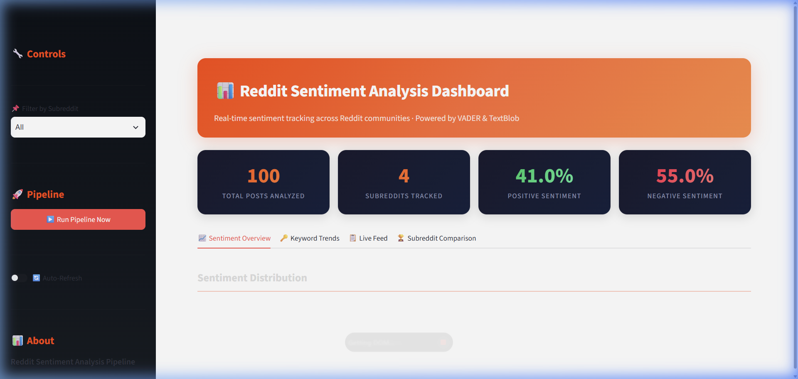
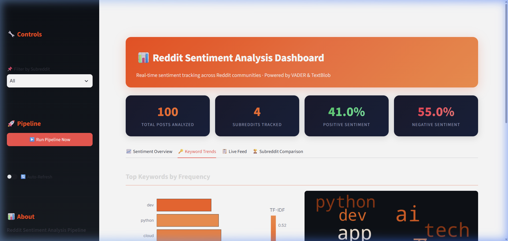
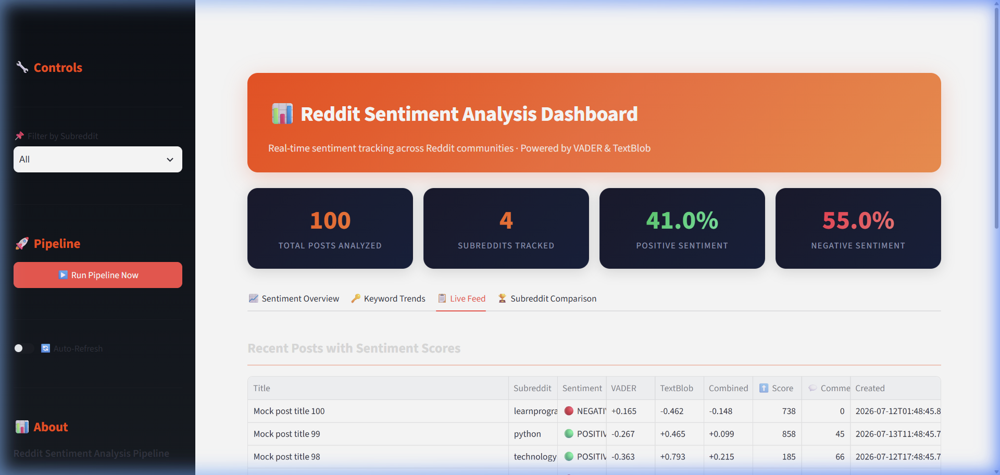
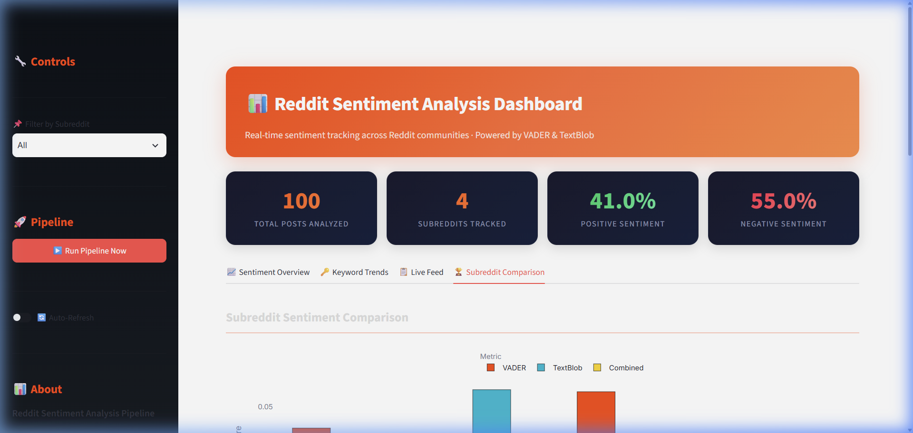

# Social Media Reddit Sentiment Analysis Pipeline 📊

A full-stack, real-time sentiment analysis pipeline that ingests posts from Reddit, analyzes their text for sentiment using dual NLP engines (VADER & TextBlob), stores the results in a local SQLite database, and presents the insights via a dynamic Streamlit dashboard.

Built entirely using native Python data structures for data handling (no `pandas` required) to keep dependencies lightweight and performance snappy.

## 🏗️ Architecture

```
Reddit API (PRAW)  →  Ingestion Engine  →  Sentiment Analyzer (VADER + TextBlob)
                                        →  Keyword Extractor (TF-IDF)
                                        →  SQLite Database
                                        →  Streamlit Dashboard (Plotly Charts + WordCloud)
```                                        
## 🚀 Features

- **Live Ingestion**: Connects to the Reddit API via PRAW to fetch the latest posts from subreddits of your choice.
- **Dual NLP Sentiment Analysis**: Analyzes text using both `vaderSentiment` and `TextBlob` for robust sentiment scoring.
- **SQLite Storage**: Efficiently stores posts, sentiment scores, and extracted keywords in a structured relational database.
- **Interactive Dashboard**: A beautiful, real-time Streamlit dashboard providing:
  - Overall sentiment distribution & gauges
  - Sentiment trends over time
  - Keyword frequency analysis & Word Clouds
  - Live feed of analyzed posts
  - Subreddit-to-subreddit comparison matrices

### Screenshots





## 🛠️ Tech Stack

- **Python 3.10+**
- **Reddit API (PRAW)**: Data ingestion
- **VADER & TextBlob**: Natural Language Processing & Sentiment Analysis
- **Scikit-learn**: TF-IDF keyword extraction
- **SQLite3**: Data Storage
- **Streamlit**: Web Dashboard
- **Plotly & WordCloud**: Data Visualization

## 📦 Setup & Installation

1. **Clone the repository**
   ```bash
   git clone <your-repo-url>
   cd social-media-reddit-sentiment-analysis-pipeline
   ```

2. **Create a virtual environment**
   ```bash
   python -m venv .venv
   # On Windows:
   .venv\Scripts\activate
   # On Mac/Linux:
   source .venv/bin/activate
   ```

3. **Install Dependencies**
   ```bash
   pip install -r requirements.txt
   ```
   *(Note: This project deliberately avoids `pandas` for core data manipulation, using standard python lists and dictionaries for maximum efficiency).*

4. **Configure Environment Variables**
   - Create a `.env` file in the root directory.
   - Add your Reddit API credentials:
     ```env
     REDDIT_CLIENT_ID=your_client_id
     REDDIT_CLIENT_SECRET=your_client_secret
     REDDIT_USER_AGENT=sentiment_analysis_pipeline_v1.0
     ```

## ⚙️ Usage

### 1. Run the Pipeline (Data Ingestion & Processing)
To pull the latest posts from Reddit and analyze them, run the pipeline module:
```bash
python -m pipeline.pipeline_runner
```
*(You can also trigger this directly from the Streamlit dashboard sidebar!)*

### 2. Launch the Dashboard (Data Visualization)
Start the interactive Streamlit server to visualize the sentiment data:
```bash
python -m streamlit run dashboard/app.py
```
The dashboard will be available in your browser at `http://localhost:8501`.

## 📂 Project Structure

```
.
├── analysis/               # NLP and text analysis logic
├── config/                 # Configuration and environment setup
├── dashboard/              # Streamlit web application & UI
├── database/               # SQLite db schemas and managers
├── ingestion/              # Reddit API wrappers (PRAW)
├── pipeline/               # Pipeline orchestrator
├── sql/                    # Raw SQL queries and table creation scripts
├── requirements.txt        # Python dependencies
├── .env.example            # Environment variable template
└── README.md               # You are here!
```
